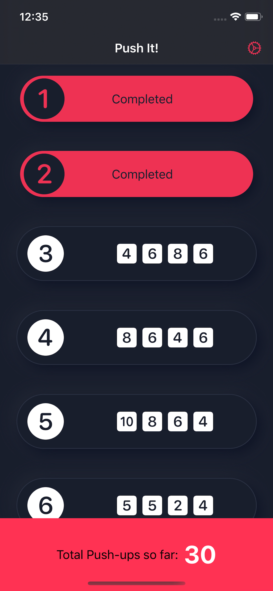

## `Challenge Exercises` App Directory 

 

### About
Push-It is my 30 day push up tracker app for helping you achieve your hopes and dreams by way of physically pushing yourself up off the ground.

If you like the project, do not forget to `put star ★`  
and follow me on GitHub:

## Requirements
Xcode 11.3

## Getting Started
Clone or download
Open the *Challenges.xcworkspace* file
Select the project you'd like to launch
Build and Run

## Navigate

- [Push It: 30 Day Push Up Challenge](#push-it)

## Push It

## Contributing
Pull requests are welcome. For major changes, please open an issue first to discuss what you would like to change.

## License
[MIT](https://choosealicense.com/licenses/mit/)

